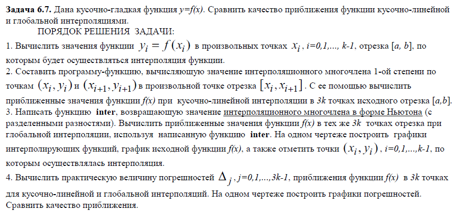

## Лабораторная работа 4. Приближение функций
### Вариант 14 
6.1.14, 6.3.7, 6.7.7, 6.9.7

### 6.1.14
http://solidstate.karelia.ru/p/tutorial/meth_calc/files/09.shtml - хороший источник

### 6.3.7

### 6.7.7

### 6.9.7

